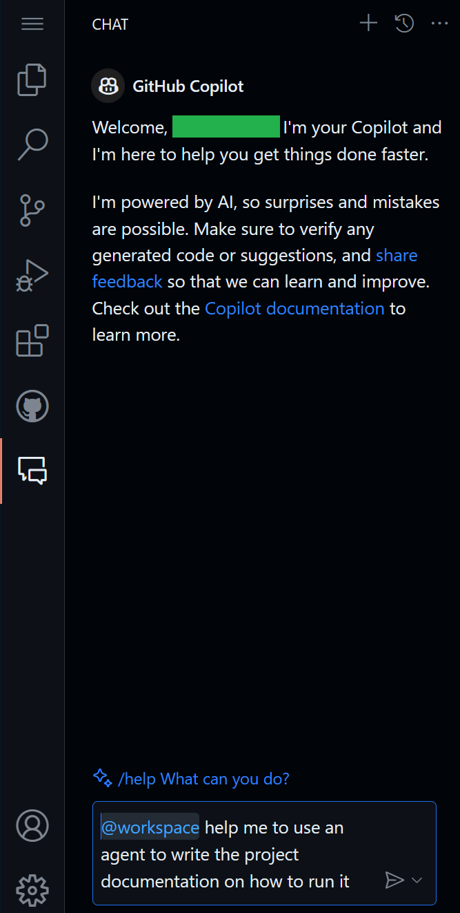

[](https://codespaces.new/MicrosoftDocs/mslearn-advanced-copilot)

# Apply advanced GitHub Copilot techniques
Discover new ways to leverage advanced GitHub Copilot techniques within a Python repository to implement an interactive HTML form and an Application Programming Interface (API) endpoint. 
Gain more practical experience by using this repository that contains a Python Web Application that hosts a Travel Weather API.


## Requirements

1. Enable your [GitHub Copilot service](https://github.com/github-copilot/signup)
1. Open [this repository with Codespaces](https://codespaces.new/MicrosoftDocs/mslearn-copilot-codespaces-python)

## 💪🏽 Exercise
The current API is not exposing country/{country} which needs to be implemented to list cities. The route should allow only GET HTTP requests with a JSON response providing information from the historical high and low for that country, city, and given month.

As with any implementation, this addition should include at least one test function to work with the pytest runner and test framework. 

### 🛠 Step 1: Add a new route 
On our first exercise we will create a new route in our API. Go to the main.py file, and by using the inline chat with the following command `ctrl` + `i` (on Windows) or  `cmd` + `i`(on Mac) ask GitHub Copilot to help you create a new API that shows you the cities of a country. 

`> Create a new route that exposes the cities of a country.`


This prompt should give you something similar like this:


```python
# Create a new route that exposes the cities of a country:
@app.get('/countries/{country}')
def cities(country: str):
    return list(data[country].keys())

```
Note: Try your new route and refine your prompt until the result is as desired.

### 🔎 Step 2: Create a test
Now that you have created a new route, let's create a test with Copilot Chat for this route that uses Spain as the country. Remember to select your code and ask Copilot Chat to help you with this specific API that we just have created.

`> /tests help me to create a new test for this route that uses Spain as the country.`




Once Copilot has helped you to create your test, try it. If this is not functioning as expected, feel free to share those details with Copilot in the chat. For example:

`> This test is not quite right, it is not including cities that doesn't exist. Only Seville is part of the API.`


It should give you another solution. Keep trying until you achieve the desired result.

### 🐍 Step 3: Use an agent to write the project
During this step we will be using an agent (workspace) to write the project documentation on how to run this project. In the GitHub Copilot Chat, we will try the following prompt:

`> @workspace help me to use an agent to write the project documentation on how to run it .`

Finally, verify the new endpoint is working by trying it out by going to the `/docs` endpoint and confirming that the endpoint shows up.


🚀 Congratulations, through the exercise, you haven't only used copilot to generate code but also done it in an interactive and fun way! You can use GitHub Copilot to not only generate code, but write documentation, test your applications and more.


# mslearn-advanced-copilot

このプロジェクトは dev container 上で動作するように構成されています。以下の手順でセットアップと実行が可能です。

## 開発環境

- OS: Debian GNU/Linux 11 (bullseye)
- 必要なコマンドラインツールは dev container にプリインストールされています。

## セットアップ手順

1. **リポジトリのクローン**
   ```sh
   git clone <このリポジトリのURL>
   cd mslearn-advanced-copilot
   ```

2. **dev container で開く**
   - VS Code の「Remote - Containers」機能を使って dev container でプロジェクトを開いてください。

3. **依存関係のインストール**
   - プロジェクトで使用しているパッケージマネージャ（例: npm, pip など）に応じて以下のコマンドを実行してください。
   - Node.js の場合:
     ```sh
     npm install
     ```
   - Python の場合:
     ```sh
     pip install -r requirements.txt
     ```

## 実行方法

- Node.js アプリの場合:
  ```sh
  npm start
  ```
- Python アプリの場合:
  ```sh
  python main.py
  ```

## テストの実行

- Node.js の場合:
  ```sh
  npm test
  ```
- Python の場合:
  ```sh
  pytest
  ```

## その他

- 詳細なコマンドや設定は各種スクリプトや設定ファイル（package.json, requirements.txt など）を参照してください。
- ホストのブラウザでウェブページを開く場合は、以下のコマンドを利用できます:
  ```sh
  "$BROWSER" <URL>
  ```

## サポート

不明点があればプロジェクト管理者までお問い合わせください。


# Legal Notices

Microsoft and any contributors grant you a license to the Microsoft documentation and other content
in this repository under the [Creative Commons Attribution 4.0 International Public License](https://creativecommons.org/licenses/by/4.0/legalcode),
see the [LICENSE](LICENSE) file, and grant you a license to any code in the repository under the [MIT License](https://opensource.org/licenses/MIT), see the
[LICENSE-CODE](LICENSE-CODE) file.

Microsoft, Windows, Microsoft Azure and/or other Microsoft products and services referenced in the documentation
may be either trademarks or registered trademarks of Microsoft in the United States and/or other countries.
The licenses for this project do not grant you rights to use any Microsoft names, logos, or trademarks.
Microsoft's general trademark guidelines can be found at http://go.microsoft.com/fwlink/?LinkID=254653.

Privacy information can be found at https://privacy.microsoft.com/en-us/

Microsoft and any contributors reserve all other rights, whether under their respective copyrights, patents,
or trademarks, whether by implication, estoppel or otherwise.
